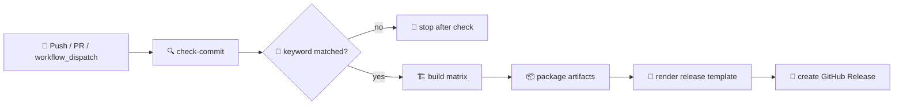

> **[📖 English](build.md)**
> **[📖 简体中文(大陆)](build.zh-cn.md)**

# 🏗️ Build and Release Workflow

This document explains the actual GitHub Actions pipeline in [build.yml](./build.yml).

## 📋 Overview

The workflow is driven by commit message keywords.
Only commits containing `build action` or `build release` enter the full build pipeline on push.
Pull requests and manual runs are still valid workflow entry points, but the current `check-commit` job is mainly designed for push-triggered release flow.

## 🔑 Commit Keyword Table

| Commit message keyword | Build matrix | GitHub Release | Typical use |
|------------------------|:------------:|:--------------:|-------------|
| `build action` | ✅ Yes | ❌ No | Verify compilation and upload CI artifacts only |
| `build release` | ✅ Yes | ✅ Yes | Build all targets and publish a GitHub Release |
| anything else | ❌ No | ❌ No | Skip build jobs after `check-commit` |

> The workflow checks `${{ github.event.head_commit.message }}` with `grep -qiE "(build action|build release)"`.

## 🧾 Commit Examples

### Will trigger build

```bash
git commit --allow-empty -m "ci: verify matrix build (build action)"
git commit -m "release: 0.3.6-rc.24 (build release)"
```

### Will skip build

```bash
git commit -m "docs: update workflow notes"
git commit -m "fix: tune card spacing"
git commit -m "refactor: clean up services"
```

## 👤 Git Identity

If the wrong profile appears in commits or release notes, set:

```bash
git config --global --replace-all user.name "VincentZyu233"
git config --global user.email "1830540513zyu@gmail.com"
```

## 🖼️ Pipeline Sketch

```text
+--------------+      +-------------------+      +------------------+
| check-commit | ---> | build (6 targets) | ---> | publish release  |
+--------------+      +-------------------+      +------------------+
        |                        |                          |
        |                        |                          |
        |                        +--> artifacts             +--> GitHub Release
        |                                                   +--> release_body.md
        +--> should_build / version / commits_log
```

## 🧭 Mermaid Flow



## 1️⃣ Stage 1: check-commit

- Runner: `ubuntu-latest`
- Outputs: `should_build`, `version`, `commits_log`
- Purpose: detect trigger keyword, read version from `pubspec.yaml`, collect commit log for release notes

If the keyword is missing, the job prints:

```text
✗ Commit message does not contain build trigger
   Skipping build (commit: abc1234)
```

## 2️⃣ Stage 2: build matrix

The build job runs only when `needs.check-commit.outputs.should_build == 'true'`.
`fail-fast: false` keeps other platforms running even if one target fails.

| Platform | Runner | Main output |
|----------|--------|-------------|
| `windows-x64` | `windows-latest` | zipped runner directory + setup exe |
| `linux-x64` | `ubuntu-22.04` | Linux bundle + `.deb` + `.AppImage` |
| `macos-x64` | `macos-15-intel` | DMG + ZIP |
| `macos-arm64` | `macos-latest` | DMG + ZIP |
| `android-multiarch` | `ubuntu-latest` | universal APK + split APKs |
| `ios-arm64` | `macos-latest` | unsigned IPA |

### 🤝 Shared steps

1. Checkout code.
2. Setup Flutter `3.41.5`.
3. Run `flutter doctor -v`.
4. Generate Apple and Windows platform projects with `flutter create`.
5. Apply committed icons with `scripts/apply-icons.py`.
6. Copy native platform plugin sources from `plugins/`.
7. Run `flutter pub get`.
8. Run `flutter analyze --no-pub || true`.

### 🧩 Platform-specific notes

- Windows copies the native C++ system info source, patches `windows/runner/CMakeLists.txt`, builds the app, then packages an Inno Setup installer.
- Linux installs packaging dependencies, generates the Linux runner, and uses `flutter_distributor` to build `.deb` and `.AppImage`.
- macOS copies `SystemInfoPlugin.swift`, patches the runner, builds two DMGs and two ZIP archives, and retries `hdiutil` when the volume is busy.
- Android copies `SystemInfoPlugin.kt`, patches `MainActivity.kt`, builds universal and split-per-ABI APKs, then verifies the outputs exist.
- iOS copies `SystemInfoPlugin.swift`, patches the generated runner, builds without codesign, and zips `Runner.app` into an IPA manually.

## 3️⃣ Stage 3: publish

- Runner: `ubuntu-latest`
- Needs: `check-commit`, `build`
- Purpose: rename artifacts with the extracted version, render release notes, and publish GitHub Release assets

### 📦 Publish steps

1. Download all uploaded artifacts.
2. Repackage or rename them into final versioned filenames.
3. Read `.github/release_template.md`.
4. Inject repository name, version, release URL base, build info, and commit log.
5. Write `release_body.md`.
6. Create a GitHub Release with `softprops/action-gh-release@v2`.

## 🏷️ Artifact Naming

| Artifact type | Final filename pattern |
|---------------|------------------------|
| Windows zip | `dart-flutter-demo-windows-x64-v<version>.zip` |
| Windows installer | `dart-flutter-demo-windows-x64-v<version>-setup.exe` |
| Linux tarball | `dart-flutter-demo-linux-x64-v<version>.tar.gz` |
| Linux packages | `dart-flutter-demo-linux-x64-v<version>.deb` / `.AppImage` |
| macOS packages | `dart-flutter-demo-macos-<arch>-v<version>.dmg` / `.zip` |
| Android APK | `dart-flutter-demo-android-<flavor>-v<version>.apk` |
| iOS IPA | `dart-flutter-demo-ios-arm64-v<version>.ipa` |

## 🔢 Version Source

The workflow reads the version from `pubspec.yaml`.
It uses the full version for app metadata and the part before `+` for the GitHub tag and artifact names.

Example:

```text
0.3.6-rc.24+20260609  ->  tag/artifact version: 0.3.6-rc.24
```

## 📝 Release Notes Inputs

The rendered GitHub Release body is assembled from:

- `.github/release_template.md`
- current repository name
- extracted version
- current commit SHA
- `github.event.head_commit.timestamp`
- commit log collected in `check-commit`

## 🔐 Permissions and Secrets

- Required workflow permission: `contents: write`
- Current release publishing uses the default `GITHUB_TOKEN`
- No extra package-registry secrets are used in this workflow file

## 💡 Practical Notes

- The repository keeps native plugin source files under `plugins/`, then copies and patches them into generated platform runners during CI.
- Windows system info collection depends on native FFI wiring in the generated runner, so `plugins/windows/patch_ci.py` is part of the critical path.
- The workflow currently publishes GitHub Releases directly with `draft: false` and `prerelease: false`.
- Linux is the only target that also emits package-manager style artifacts in the same run.
- If you want a release, the safest commit message is an empty commit containing `build release`.
