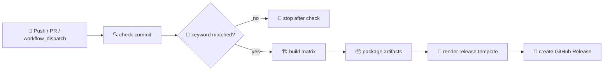

> **[📖 English](build.md)**
> **[📖 简体中文(大陆)](build.zh-cn.md)**

# 🏗️ 构建与发布工作流

本文说明 [build.yml](./build.yml) 里当前真实生效的 GitHub Actions 流水线。

## 📋 概览

这个工作流由 commit message 关键词驱动。
只有 push 的 commit 信息里包含 `build action` 或 `build release`，才会进入完整构建流水线。
Pull Request 和手动触发仍然是合法入口，但当前 `check-commit` job 主要围绕 push 触发的发布流程设计。

## 🔑 Commit 关键词表

| Commit 信息关键词 | 构建矩阵 | GitHub Release | 典型用途 |
|------------------|:--------:|:--------------:|----------|
| `build action` | ✅ 是 | ❌ 否 | 只验证编译并上传 CI 产物 |
| `build release` | ✅ 是 | ✅ 是 | 构建全部目标并发布 GitHub Release |
| 其他任意内容 | ❌ 否 | ❌ 否 | 在 `check-commit` 之后跳过构建任务 |

> 工作流会用 `grep -qiE "(build action|build release)"` 检查 `${{ github.event.head_commit.message }}`。

## 🧾 Commit 示例

### 会触发构建

```bash
git commit --allow-empty -m "ci: verify matrix build (build action)"
git commit -m "release: 0.3.6-rc.24 (build release)"
```

### 会跳过构建

```bash
git commit -m "docs: update workflow notes"
git commit -m "fix: tune card spacing"
git commit -m "refactor: clean up services"
```

## 👤 Git 身份

如果 commit 或 release notes 里显示了错误的用户信息，执行：

```bash
git config --global --replace-all user.name "VincentZyu233"
git config --global user.email "1830540513zyu@gmail.com"
```

## 🖼️ 流水线草图

```text
+--------------+      +-------------------+      +------------------+
| check-commit | ---> | build (6 targets) | ---> | publish release  |
+--------------+      +-------------------+      +------------------+
        |                        |                          |
        |                        |                          |
        |                        +--> artifacts             +--> GitHub Release
        |                                                   +--> release_body.md
        +--> should_build / version / commits_log
```

## 🧭 Mermaid 流程图



## 1️⃣ 阶段 1：check-commit

- Runner：`ubuntu-latest`
- 输出：`should_build`、`version`、`commits_log`
- 作用：识别触发关键词、从 `pubspec.yaml` 读取版本号、为 release notes 收集 commit 日志

如果缺少关键词，job 会输出：

```text
✗ Commit message does not contain build trigger
   Skipping build (commit: abc1234)
```

## 2️⃣ 阶段 2：build matrix

只有在 `needs.check-commit.outputs.should_build == 'true'` 时才会运行 build job。
`fail-fast: false` 可以保证单个平台失败时，其余平台继续执行。

| 平台 | Runner | 主要输出 |
|------|--------|----------|
| `windows-x64` | `windows-latest` | runner 目录压缩包 + setup exe |
| `linux-x64` | `ubuntu-22.04` | Linux bundle + `.deb` + `.AppImage` |
| `macos-x64` | `macos-15-intel` | DMG |
| `macos-arm64` | `macos-latest` | DMG |
| `android-multiarch` | `ubuntu-latest` | universal APK + split APK |
| `ios-arm64` | `macos-latest` | 未签名 IPA |

### 🤝 共享步骤

1. 检出代码。
2. 安装 Flutter `3.41.5`。
3. 运行 `flutter doctor -v`。
4. 用 `flutter create` 生成 Apple 和 Windows 平台工程。
5. 用 `scripts/apply-icons.py` 应用已提交的图标。
6. 从 `plugins/` 复制原生平台插件源码。
7. 运行 `flutter pub get`。
8. 运行 `flutter analyze --no-pub || true`。

### 🧩 平台专项说明

- Windows 会复制原生 C++ 系统信息源码，patch `windows/runner/CMakeLists.txt`，构建应用，然后打包 Inno Setup 安装器。
- Linux 会安装打包依赖，生成 Linux runner，并通过 `flutter_distributor` 构建 `.deb` 和 `.AppImage`。
- macOS 会复制 `SystemInfoPlugin.swift`，patch runner，构建两个 DMG，并在卷占用时重试 `hdiutil`。
- Android 会复制 `SystemInfoPlugin.kt`，patch `MainActivity.kt`，构建 universal 和 split-per-ABI APK，然后校验输出文件存在。
- iOS 会复制 `SystemInfoPlugin.swift`，patch 生成的 runner，在不签名的情况下构建，并手动把 `Runner.app` 打成 IPA。

## 3️⃣ 阶段 3：publish

- Runner：`ubuntu-latest`
- 依赖：`check-commit`、`build`
- 作用：给产物重命名为带版本号的最终文件名，渲染 release notes，并发布 GitHub Release 附件

### 📦 发布步骤

1. 下载所有已上传的 artifacts。
2. 重新打包或重命名为最终版本化文件名。
3. 读取 `.github/release_template.md`。
4. 注入仓库名、版本号、Release URL 基址、build info 和 commit 日志。
5. 生成 `release_body.md`。
6. 使用 `softprops/action-gh-release@v2` 创建 GitHub Release。

## 🏷️ 产物命名

| 产物类型 | 最终文件名模式 |
|----------|----------------|
| Windows zip | `dart-flutter-demo-windows-x64-v<version>.zip` |
| Windows 安装器 | `dart-flutter-demo-windows-x64-v<version>-setup.exe` |
| Linux tarball | `dart-flutter-demo-linux-x64-v<version>.tar.gz` |
| Linux 包 | `dart-flutter-demo-linux-x64-v<version>.deb` / `.AppImage` |
| macOS DMG | `dart-flutter-demo-macos-<arch>-v<version>.dmg` |
| Android APK | `dart-flutter-demo-android-<flavor>-v<version>.apk` |
| iOS IPA | `dart-flutter-demo-ios-arm64-v<version>.ipa` |

## 🔢 版本来源

工作流从 `pubspec.yaml` 读取版本号。
完整版本用于应用元数据，`+` 之前的部分用于 GitHub tag 和产物文件名。

示例：

```text
0.3.6-rc.24+20260609  ->  tag/产物版本: 0.3.6-rc.24
```

## 📝 Release Notes 输入

最终渲染出的 GitHub Release 正文由以下内容拼出来：

- `.github/release_template.md`
- 当前仓库名
- 提取出的版本号
- 当前 commit SHA
- `github.event.head_commit.timestamp`
- `check-commit` 收集到的 commit 日志

## 🔐 权限与密钥

- 必需的工作流权限：`contents: write`
- 当前发布 GitHub Release 只使用默认的 `GITHUB_TOKEN`
- 这个 workflow 文件里没有用到额外的包管理器发布密钥

## 💡 实用备注

- 仓库把原生插件源码保存在 `plugins/` 下，再在 CI 里复制并 patch 到生成出来的平台 runner 中。
- Windows 系统信息采集依赖生成 runner 里的原生 FFI 接线，因此 `plugins/windows/patch_ci.py` 属于关键路径。
- 当前 workflow 直接发布 GitHub Release，配置是 `draft: false` 和 `prerelease: false`。
- Linux 是唯一一个在同一次运行里额外产出包管理器风格安装包的目标平台。
- 如果你要稳定出 release，最保险的 commit message 还是带 `build release` 的空提交。
